Esta atividade tem como objetivo o deploy e avaliação de suas aplicações em um ambiente virtualizado. Vamos utilizar o VirtualBox do LCC3 para fazer criar máquinas virtuais e colocar em execução as aplicações desenvolvidas na atividade 2\. Além disso, vamos realizar testes de stress para diferentes configurações. Para tal, vocês devem seguir os passos abaixo. 

1\. Acesse o VirtualBox na sua conta do LCC3

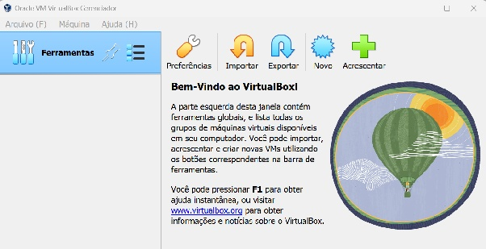

2\. Use uma imagem pre configurada, Disco Virtual (VDI), para criar a sua máquina virtual. 

- Acesse o disco VDI em /local/uasc/images e copie e imagem ubuntu\_serve\_2204\_poi.vdi para /tmp (importante usar o tmp)

3\. Clique em novo no VirtualBox para criar a sua máquina virtual.  

- Escolha um nome para a sua máquina virtual  
- Defina o diretório de saída como /tmp (**IMPORTANTE\!**)  
- Selecione tipo e versão como na imagem abaixo (o VDI é de SO Linux)  
- Pressione **Próximo**

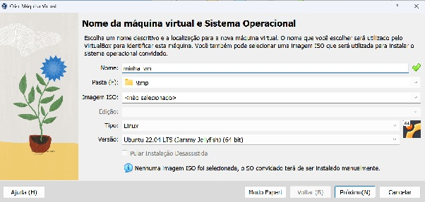

- Configure a quantidade de recursos computacionais (1CPU e 1GB de RAM são suficientes)  
- Pressione **Próximo**

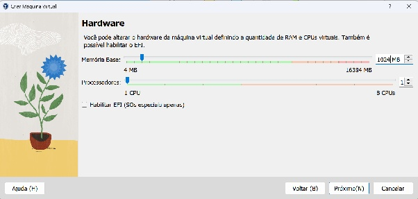

- Selecione a opção de usar um disco existem e informe o caminho para o VDI em /tmp

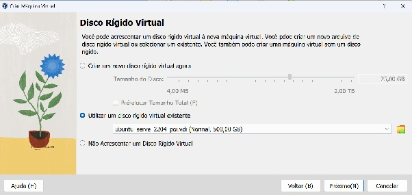

- Finalize a criação da sua máquina virtual 

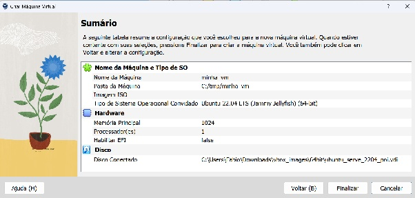

4\. Inicialize a sua máquina virtual e após o boot acesse a máquina com as seguintes informações: 

- login: osboxes  
- password: osboxes.org

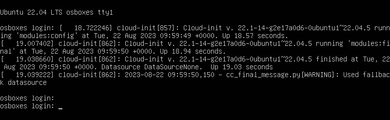

5\. Para testar o acesso instale na máquina virtual um web service (nginx) simular uma aplicação em execução

- Instale o nginx: sudo apt install nginx  
- Verifique o seu status: sudo systemctl status nginx  
- Verifique o acesso a aplicação: curl localhost:80

6\. Na máquina hospedeira (sua máquina no LCC3) teste o acesso a [http\://localhost:80](http://localhost:80) 

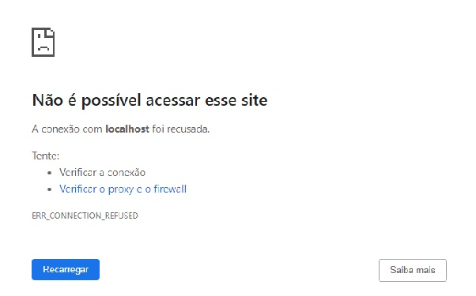

7\. Sua máquina local não consegue enxergar aplicações e serviços executando na máquina virtual. Para tal, você precisa abrir portas de acesso e fazer um mapeamento. 

- Com a máquina virtual desligada acesse a confuguração de rede da máquina

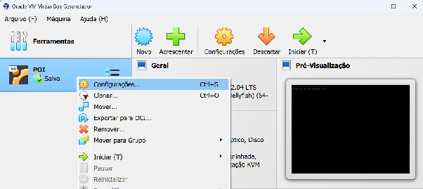

- Na seção de configurações avançadas, acesse o redirecionamento de portas

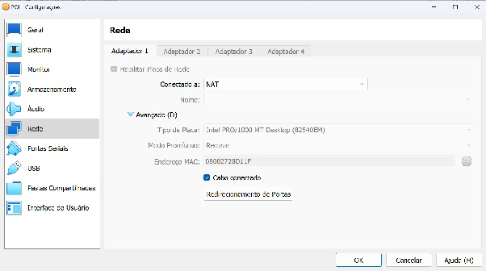

- Defina uma regra de redirecionamento entre o SO hospedeiro (máquina local) e convidado (sua máquina virtual)

- Porta do hospedeiro (vai ser acessada no browser local)  
- Porta do convidado (porta que a aplicação está escutando dentro da vm)

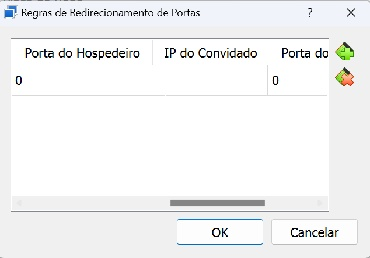

8\. Na máquina hospedeira (sua máquina no LCC3) teste o acesso a [http\://localhost:80](http://localhost:80) 

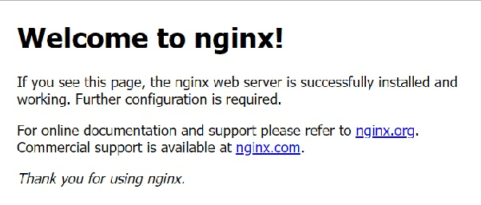

9\. Agora é o momento de fazer o deploy das suas aplicações e mostrar em execução. 

10\. Realize novos testes de stress para diferentes configurações de recursos da sua máquina virtual (considere apenas uma das suas aplicações).

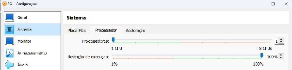

Por fim, você deve documentar o processo (adicionar screen shots), salvar o disco da sua máquina virtual e salvar em um diretório do drive. 

- **Observação**: Não esqueça de responder o formulário no classroom

Material complementar 

- [Como criar VM nos virtual box a partir de uma imagem ISO](https://www.treinaweb.com.br/blog/criando-uma-maquina-virtual-com-a-virtualbox)  
- [Como instalar adicionais para convidados (Guest Additions)](https://www.vivaolinux.com.br/artigo/Instalando-Adicionais-para-Convidados-para-VirtualBox-no-Debian-Linux-Mint-e-Ubuntu)  
- [Como compartilhar diretórios entre a máquina virtual e a máquina hospedeiro](https://www.vivaolinux.com.br/dica/Compartilhamento-de-pastas-no-VirtualBox)